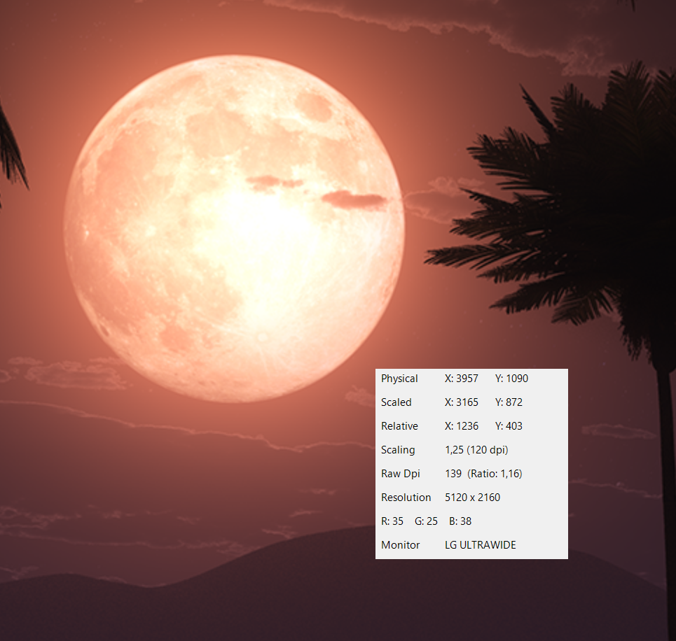

# MPos - Mouse Position Tracker (Fork)

> 🚀 Modernized fork of the original [MPos](https://github.com/bluegrams/MPos) — now with enhanced DPI-awareness, multimonitor support, and UI improvements. A mouse position tracker and DPI information for Windows 10 and 11.

This project is a continued development of the original **MPos - Mouse Position Tracker**. While the original tool was a minimalistic and portable way to track mouse position and monitor DPI scaling on Windows, this fork builds upon it with a focus on **modern displays**, **multimonitor environments**, and **per-monitor DPI support**.

MPos is a minimalistic and easy to use tool to track the current position of the cursor on the screen. MPos especially considers High-DPI monitors and DPI scaling of Windows. The tracked cursor position is provided in physical/ unscaled Windows pixels and in coordinates scaled by DPI-virtualization. The tool also provides information about the DPI scaling and the raw/ physical DPI of the current monitor.

## Features

- Track the cursor position in physical pixels (*Physical*) and scaled pixels (*Scaled*)
- See the cursor position relative to the active window (*Relative*)
- See the DPI scaling of the current monitor (*Scaling*)
- See the raw (real) DPI of the current monitor (*Raw Dpi*)

## ✨ New Features in This Fork

- Show **which monitor** the cursor is currently on (including friendly name when available)
- Detect and display **monitor DPI**, **DPI scaling**, and **raw DPI** using Windows 10+ APIs
- Corrected now shows both **physical** and **logical (scaled)** mouse coordinates
- Track mouse position **relative to the focused window**
- Live preview of the **pixel color under the cursor**
- **Multi-monitor awareness** with accurate DPI context per screen
- Optionally **toggle visibility** of each data field via context menu
- Configurable **global shortcut** to grab & log position data
- Optional **dark mode**, opacity settings, and persistent layout
- Fully portable with no installation needed

## 🖥 Requirements

- **Windows 10 or newer**
- **.NET Framework 4.8** or newer

This project uses Windows APIs introduced in Windows 10 for accurate per-monitor DPI support and virtualized coordinates.

## 🔧 Setup & Building

You can build the project using **Visual Studio 2022** or newer. It is fully self-contained and does not require installation. Simply build and run.

## 🚧 License

This project is based on the original [MPos by Bluegrams](https://github.com/bluegrams/MPos), which is licensed under the **BSD-3-Clause** license. This fork maintains the same license.

See [LICENSE.txt](LICENSE.txt) for details.
